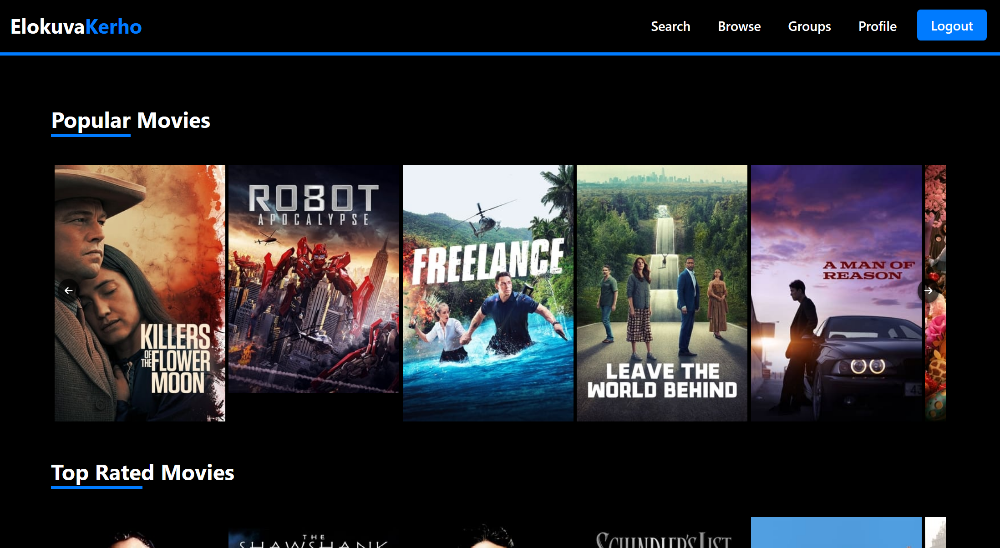

# ELOKUVAKERHO-WEBSOVELLUS

## Johdanto

Elokuvakerho on Oulun Ammattikorkeakoulun tieto- ja viestintätekniikan 2. vuoden opiskelijoiden toteuttama websovellusprojekti. Se on laaja elokuvien ja sarjojen tietopankki, joka on suunniteltu sekä elokuvaharrastajille että satunnaiskatsojille. Sovelluksessa voi luoda oman käyttäjäprofiilin, jonka kautta on mahdollista arvostella elokuvia sekä osallistua keskusteluihin muiden käyttäjien kanssa ryhmissä.

## Miten Sovellus Toimii?

Elokuvakerho-sovelluksessa voi selata erilaisia elokuvia ja sarjoja sekä lukea muiden käyttäjien arvosteluita ilman rekisteröitymistä. Mikäli haluaa hyödyntää kaikki sovelluksen ominaisuudet, voi sovellukseen rekisteröityä ja luoda oman käyttäjäprofiilin. Rekisteröitynyt käyttäjä voi lisätä elokuvia suosikkeihin ja kirjoittaa omia arvosteluja. Kaikki omat suosikit ja arvostelut tallentuvat profiiliin, josta ne ovat helposti uudelleen löydettävissä. Sovelluksessa on mahdollista myös perustaa uusia ryhmiä sekä lähettää liittymispyyntöjä jo olemassa oleviin ryhmiin. Ryhmissä jäsenet voivat jakaa keskenään kiinnostavia uutisia ja käydä keskusteluja.

### 

## Alustava UI-Suunnitelma

## Sovelluksen ER-Kaavio

## Millä Teknologioilla Tehty?

Projektimme on rakennettu React-sovelluksena, jota kehitämme Visual Studio Coden avulla. Palvelinpuolen olemme toteuttaneet Node.js-alustalla ja tietokantana käytämme PostgreSQL:ää, jonka loimme Renderin kautta.

Käyttämämme koodikielet ovat JavaScript, HTML ja CSS. Sovelluksen käyttöliittymän suunnitteluun olemme käyttäneet Figmaa ja tietokannan ER-kaavion luontiin MySQL Workbenchiä.

## Ketkä Tekivät?

Ryhmämme jäsenet ovat Roope Nahkala, Tomi Pihlajamaa, Valtteri Vimpari, Julius Pohjanen ja Noora Ylitalo.

## Esittelyvideo

[Linkki esittelyvideoon](link-to-video)

## Linkki Sovellukseen

[Elokuvakerho Websovellus](https://elokuvakerho.onrender.com/)
